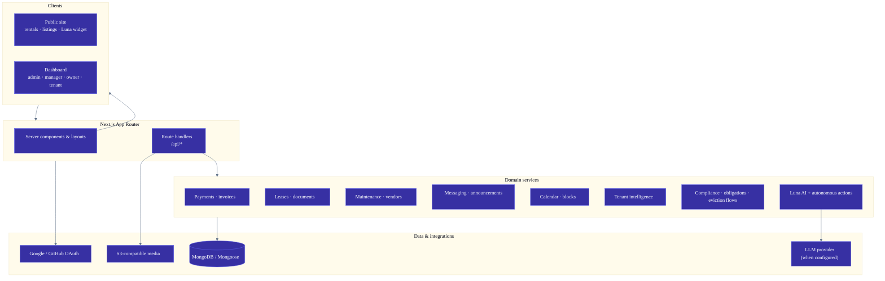
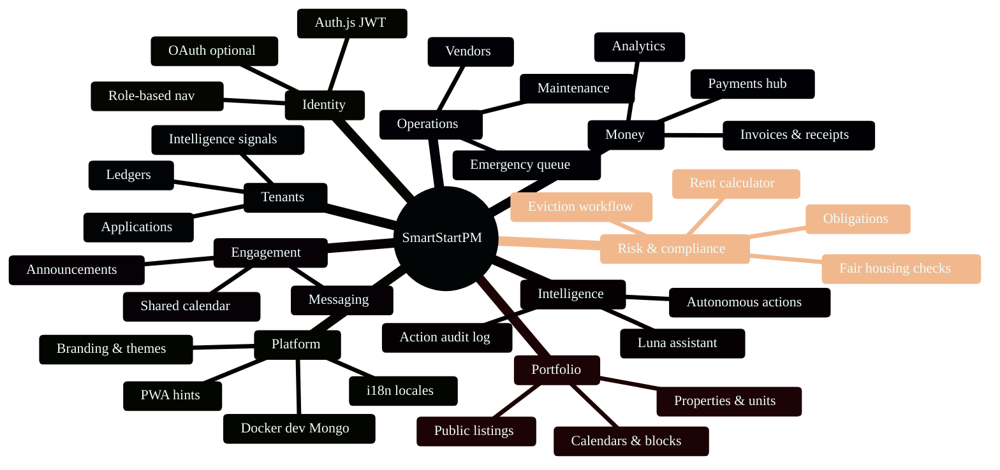
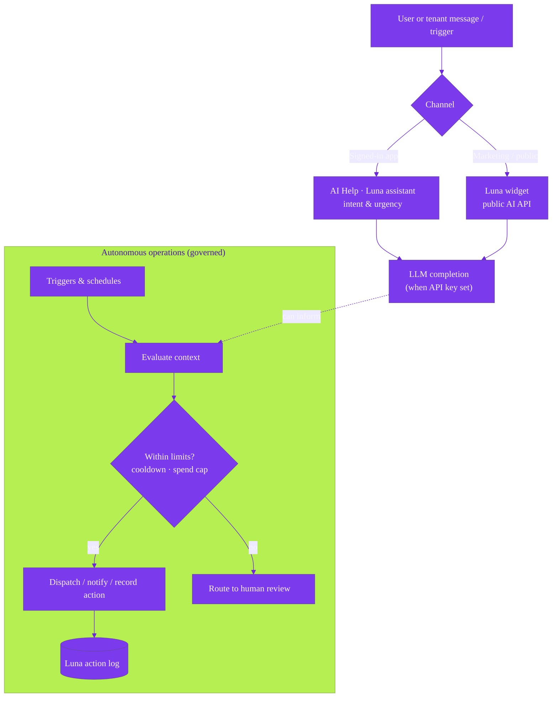

<div align="center">

# SmartStartPM · PropertyPro

### *Feature atlas · architecture · competitive framing*

<sub>Next.js · MongoDB · Auth.js · multi-role operations platform</sub>

</div>

---

> **Purpose**  
> This document summarizes capabilities **implemented in this repository** and compares them—fairly—to common alternatives. Use it for **sales, onboarding, and investors**. It is **not legal advice**; compliance tools support workflows and education only.

<details>
<summary><strong>Typography & diagrams (how to view)</strong></summary>

- **Mermaid diagrams** render on **GitHub**, **GitLab**, many **VS Code** extensions (*Markdown Preview Mermaid Support*), **Obsidian** (native), and **Notion** (paste as code block where supported).
- Plain Markdown cannot embed webfonts portably. For a **serif editorial look** locally, try:
  - **Obsidian**: Settings → Appearance → **Text font** → e.g. *Source Serif 4*, *Literata*, or *Newsreader*.
  - **VS Code**: *Markdown Preview Enhanced* allows custom CSS; set `body { font-family: "Source Serif 4", "Iowan Old Style", Georgia, serif; line-height: 1.65; }` and `h1,h2,h3 { font-family: "DM Sans", system-ui, sans-serif; letter-spacing: -0.02em; }`.

</details>

---

## 1 · Platform architecture (at a glance)

*End-to-end flow from browser to data and external services.*



---

## 2 · Capability map (feature explosion)

*Major product domains as a radial mind map—useful for demos and RFP checklists.*



---

## 3 · Roles × surface area

*Who touches which parts of the system (simplified from sidebar / `UserRole`).*


---

## 4 · Luna: assistant vs autonomous layer

*Why “chat” and “agent” are both first-class in this codebase.*



---

## 5 · Competitive landscape (category view)

*Positioning by **breadth** (x) and **automation / AI depth** (y)—illustrative, not market data.*

```mermaid
%%{init: {
  'theme': 'base',
  'themeVariables': {
    'primaryColor': '#334155',
    'primaryTextColor': '#f8fafc',
    'secondaryColor': '#e2e8f0',
    'tertiaryColor': '#fef08a',
    'lineColor': '#94a3b8',
    'fontFamily': 'ui-sans-serif, system-ui, sans-serif'
  }
}}%%
quadrantChart
  title Competitive categories (conceptual)
  x-axis Low operational breadth --> High operational breadth
  y-axis Low automation / AI --> High automation / AI
  quadrant-1 Target zone
  quadrant-2 Niche depth
  quadrant-3 Point tools
  quadrant-4 Legacy suites
  Rent-only apps: [0.35, 0.25]
  Spreadsheets + email: [0.2, 0.1]
  Legacy PMS: [0.65, 0.35]
  Generic CRM: [0.45, 0.2]
  SmartStartPM (this repo): [0.88, 0.82]
```

---

## Product overview

**SmartStartPM** (package name `propertypro`) is a **multi-role property operations platform**: admins, managers, owners, and tenants share one system for properties, leases, payments, maintenance, messaging, calendar, analytics, automation, and (when configured) **Luna** AI. The **public site** adds rentals discovery, property detail, the **Luna** concierge widget, and **localized** marketing.

---

## Core feature areas

### Identity, roles, and access

- **Auth.js** (NextAuth) with **JWT** sessions, optional **Google / GitHub OAuth**, and **email + password**.
- **Role-based navigation**: Admin, Manager, Owner, Tenant.
- **Administration**: users, roles, API keys, demo leads, error surfaces.

### Portfolio and units

- **Properties**: list, create/edit, availability, all-units view, property and unit detail.
- **Calendars**: portfolio, property, and unit views; **date blocking** patterns across APIs/UI.
- **Public listings**: `/rentals`, `/properties/[id]`, map/geocode flows where implemented.

### Tenants, applications, intelligence

- **Tenants**: CRUD, applications, detail, **ledger** views.
- **Tenant intelligence** (where enabled): portfolio/scoring-style APIs—**risk signals and insight**, not a replacement for bureau credit reports.

### Leases and documents

- **Leases**: active, expiring, management, **invoices**, **documents**, tenant “my leases.”
- **Payments** tied to leases: pay flows, receipts, overdue, analytics.

### Financial operations

- **Payments hub**: record, pay rent (tenant), history, analytics.
- **Analytics**: financial, occupancy, maintenance.

### Maintenance and vendors

- **Work orders**: list, emergency, tenant submit / “my requests,” detail/edit.
- **Vendors** + automation hooks for **dispatch-style** workflows (Luna).

### Messaging and announcements

- **In-app messaging** and **announcements** API—centralized comms vs. scattered email.

### Calendar and events

- **Shared calendar** + settings; RSVP-oriented flows where implemented.

### Automation and AI

- **Luna assistant**: prompts, specialties, **intent/urgency** analysis when LLM configured.
- **Public Luna widget** on marketing pages.
- **Luna autonomous agent**: triggers, **cooldowns**, **spending limits**, **vendor selection**, **localized** messaging, **lease-renewal-style** state handling—**agentic**, not only chat.
- **Automation hub**: Luna console, **action logs**, settings.

### Compliance (operations support)

> **Disclaimer:** Workflow support, checklists, calculators, and records—**not** automatic legal compliance.

- **Compliance dashboard**: obligations, eviction workflow/cases, fair-housing-style checks, jurisdiction rules, rent calculator, seed/cron-style routes.
- **Property compliance profile** on property experiences.

### Platform and GTM

- **i18n**: multiple locale JSON trees.
- **Branding** API, display themes, white-label-oriented landing blocks.
- **PWA**: manifest, service worker, install hints.
- **Media**: S3-compatible uploads (AWS SDK).
- **DX**: Docker Mongo, seeds, demo accounts, import/export scripts.

---

## Technical stack

| Layer | Choice | Effect |
|--------|--------|--------|
| App | **Next.js (App Router)** | Marketing + dashboard + secure APIs in one deployable app. |
| Data | **MongoDB + Mongoose** | Flexible models for ops, compliance artifacts, automation logs. |
| Auth | **Auth.js** | Modern sessions; OAuth-ready; credentials for self-host. |
| UI | **React + Radix + Tailwind** | Accessible, fast iteration. |
| Automation | **Luna services + models** | **Persisted** actions with status/errors—not ephemeral chat only. |

---

## Competitive comparison (fair framing)

“**Typical competitors**” = **categories**, not a single vendor’s roadmap.

### vs. spreadsheet + email + calendar

| Dimension | Typical | This app |
|-----------|---------|----------|
| Truth | Divergent files/threads | **One DB**, role-aware UI |
| Maintenance | Ad-hoc texts | **Tickets**, emergency, **portals** |
| Money | Manual | **Invoices**, pay, overdue, **analytics** |
| Scale | Pain ~50–200+ units | **Many units** + **automation** |

**Lift:** Ops data in **one system** with **APIs**, not static files.

### vs. rent-collection-only apps

| Dimension | Typical | This app |
|-----------|---------|----------|
| Scope | Rent + notices | **Leases**, maintenance, messaging, calendar, owners, applications |
| Sides | Often landlord-only | **Tenant + owner + manager + admin** |
| Automation | Thin | **Luna actions**, notifications |
| Intelligence | Rare | **Tenant intelligence** surfaces |

**Lift:** Rent is **one module** in a **full OS**.

### vs. legacy PMS suites

| Dimension | Legacy | This app |
|-----------|--------|----------|
| UX | Older patterns | **Modern** dashboard + landing + PWA-minded UX |
| AI | Add-on / none | **Assistant + autonomous** patterns in-repo |
| Compliance tools | Often external | **In-app compliance hub** + property profile |
| Deploy | Vendor-only | **Self-hostable** with env-driven config |

**Lift:** **Modern stack** + **AI/automation** + **compliance-adjacent** flows in **one codebase**.

### vs. generic CRMs for rentals

| Dimension | CRM | This app |
|-----------|-----|----------|
| Model | Custom objects | **Leases, units, maintenance, invoices** first-class |
| Portals | DIY | **Tenant/owner/manager** paths scaffolded |
| Flows | Generic | **Applications**, **emergency maintenance**, rental requests |

**Lift:** **Domain model = housing operations**, not generic pipelines.

---

## Why this implementation reads as “more advanced”

1. **Breadth + depth** — Beyond listings or rent: portfolio → money → work → comms → calendar → analytics → admin → automation.
2. **Agentic layer** — Luna: **actions**, guardrails, **audit-style logs**—closer to **ops automation** than FAQ bots.
3. **Multi-role** — Real **tenant** and **owner/manager** journeys in one nav model.
4. **Compliance-oriented surfaces** — Obligations, eviction workflow UI, fair-housing checks, calculators—**risk-aware** product design.
5. **Current platform** — Next.js App Router + Auth.js + MongoDB: easier to extend with **APIs**, **webhooks**, and **new AI** than many monoliths.

---

## Caveats (before hard claims in marketing)

- **Availability** depends on **env** (`OPENAI_API_KEY`, OAuth, S3, email, Mongo reachable).
- **Compliance** features ≠ legal advice; law is **jurisdictional**.
- **Tenant intelligence** ≠ **FICO** or regulated screening without certified integrations.
- Competitors differ by **region, asset class, price**; differentiate **your** deployment honestly.

---

## Suggested one-liner

> **SmartStartPM** is a **full-stack, multi-role property operations platform**—payments, maintenance, messaging, calendar, analytics, compliance-oriented workflows, and **Luna** (assistant chat **plus** governed autonomous actions)—on **Next.js** and **MongoDB** for modern deploy and extension.

---

<div align="center">

<sub><em>Atlas generated from sidebar navigation, dashboard routes, Luna services, compliance APIs, and tenant-intelligence APIs. Refresh when major modules ship.</em></sub>

</div>
