# Feature Architecture Diagram

## Main Architecture

```mermaid
flowchart TD
  subgraph publicUi [Public Frontend]
    rentals[Rentals Search]
    propertyDetail[Property Detail]
    stayFinder[Stay Finder]
    contact[Contact / Inquiry]
  end

  subgraph dashboardUi [Dashboard Frontend]
    properties[Properties / Units]
    requests[Rental Requests]
    leases[Leases / Documents]
    payments[Payments / Invoices]
    maintenance[Maintenance]
    calendar[Calendar]
    tenants[Tenants]
    vendors[Vendors]
    messages[Messages]
    compliance[Compliance]
  end

  subgraph apis [Route Handlers]
    propertyApi[Properties API]
    requestApi[Rental Requests API]
    leaseApi[Leases API]
    paymentApi[Payments API]
    invoiceApi[Invoices API]
    maintenanceApi[Maintenance API]
    calendarApi[Calendar API]
    tenantApi[Tenants API]
    vendorApi[Vendors API]
    messagingApi[Messaging / Notifications API]
    complianceApi[Compliance API]
    uploadApi[Upload API]
  end

  subgraph services [Service Layer]
    propertySvc[Property / Unit Services]
    leaseSvc[Lease Services]
    paymentSvc[Payment Services]
    receiptSvc[Receipt Services]
    calendarSvc[Calendar Services]
    emailSvc[Email Service]
    smsSvc[SMS Service]
    messagingSvc[Messaging Service]
    opsSvc[Operations Metrics / Automation]
  end

  subgraph data [MongoDB Models]
    propertyModel[Property]
    rentalRequestModel[RentalRequest]
    applicationModel[Application]
    leaseModel[Lease]
    documentModel[Document]
    paymentModel[Payment]
    invoiceModel[Invoice]
    receiptModel[PaymentReceipt]
    maintenanceModel[MaintenanceRequest]
    vendorModel[Vendor]
    vendorJobModel[VendorJob]
    tenantModel[Tenant]
    userModel[User]
    eventModel[Event]
    calendarSettingsModel[CalendarSettings]
    complianceModels[Compliance Models]
  end

  subgraph external [External Integrations]
    stripe[Stripe]
    smtp[SMTP Email]
    twilio[Twilio SMS]
    r2[Cloudflare R2]
    googleCalendar[Google Calendar]
    googleMaps[Google Maps]
  end

  rentals --> propertyApi
  propertyDetail --> propertyApi
  stayFinder --> propertyApi
  contact --> messagingApi

  properties --> propertyApi
  requests --> requestApi
  leases --> leaseApi
  payments --> paymentApi
  payments --> invoiceApi
  maintenance --> maintenanceApi
  calendar --> calendarApi
  tenants --> tenantApi
  vendors --> vendorApi
  messages --> messagingApi
  compliance --> complianceApi

  propertyApi --> propertySvc
  requestApi --> propertySvc
  leaseApi --> leaseSvc
  paymentApi --> paymentSvc
  invoiceApi --> paymentSvc
  maintenanceApi --> opsSvc
  calendarApi --> calendarSvc
  tenantApi --> opsSvc
  vendorApi --> opsSvc
  messagingApi --> messagingSvc
  uploadApi --> opsSvc
  complianceApi --> opsSvc

  propertySvc --> propertyModel
  propertySvc --> rentalRequestModel
  propertySvc --> applicationModel
  leaseSvc --> leaseModel
  leaseSvc --> documentModel
  paymentSvc --> paymentModel
  paymentSvc --> invoiceModel
  receiptSvc --> receiptModel
  opsSvc --> maintenanceModel
  opsSvc --> vendorModel
  opsSvc --> vendorJobModel
  opsSvc --> tenantModel
  opsSvc --> userModel
  calendarSvc --> eventModel
  calendarSvc --> calendarSettingsModel
  opsSvc --> complianceModels

  paymentSvc --> stripe
  emailSvc --> smtp
  smsSvc --> twilio
  uploadApi --> r2
  leaseApi --> r2
  calendarSvc --> googleCalendar
  propertyApi --> googleMaps
  messagingSvc --> emailSvc
  messagingSvc --> smsSvc
  paymentSvc --> receiptSvc
```

## Lifecycle Diagram

```mermaid
flowchart LR
  inquiry[Inquiry or Rental Request] --> review[Review / Approve Request]
  review --> reservation{Reservation Record?}
  reservation -->|Current code| leaseMaybe[Optional Lease Creation]
  reservation -->|Missing today| reservationRecord[Confirmed Reservation]
  leaseMaybe --> contract[Contract / Lease Document]
  contract --> signature[Signature]
  signature --> payment1[Deposit / First Payment]
  payment1 --> payment2[Remaining Balance]
  payment2 --> welcome[Welcome Message]
  welcome --> access[Wi-Fi / Door Code Delivery]
  access --> checkin[Check-in]
  checkin --> stay[Stay / Active Occupancy]
  stay --> maintenance[Maintenance Request]
  stay --> checkout[Check-out]
  checkout --> cleaning[Cleaning / Turnover]

  classDef current fill:#dbeafe,stroke:#2563eb,color:#111827;
  classDef partial fill:#fef3c7,stroke:#d97706,color:#111827;
  classDef missing fill:#fee2e2,stroke:#dc2626,color:#111827;

  class inquiry,review,contract,signature,maintenance current;
  class leaseMaybe,payment1,payment2,welcome,access partial;
  class reservationRecord,checkin,checkout,cleaning missing;
```

## Module Mapping Notes
### Public discovery and availability
- Rentals search: [`src/app/(landing)/rentals/page.tsx`](src/app/(landing)/rentals/page.tsx)
- Property detail: [`src/app/(landing)/properties/[id]/page.tsx`](src/app/(landing)/properties/[id]/page.tsx)
- Availability API: [`src/app/api/properties/public/available-for-stay/route.ts`](src/app/api/properties/public/available-for-stay/route.ts)
- Availability data: [`src/models/DateBlock.ts`](src/models/DateBlock.ts)

### Reservation / request handling
- Request UI: [`src/app/dashboard/rental-requests/page.tsx`](src/app/dashboard/rental-requests/page.tsx)
- Request APIs: [`src/app/api/rental-requests/`](src/app/api/rental-requests/)
- Request data: [`src/models/RentalRequest.ts`](src/models/RentalRequest.ts)
- Important gap: there is no dedicated `Reservation` model today.

### Contracts / signature
- Lease screens: [`src/app/dashboard/leases/`](src/app/dashboard/leases/)
- Lease APIs: [`src/app/api/leases/`](src/app/api/leases/)
- Sign route: [`src/app/api/leases/[id]/sign/route.ts`](src/app/api/leases/[id]/sign/route.ts)
- Documents: [`src/models/Document.ts`](src/models/Document.ts)
- Important gap: outbound signature invitation flows are missing.

### Payments / receipts
- Payment pages: [`src/app/dashboard/payments/`](src/app/dashboard/payments/)
- Payment APIs: [`src/app/api/payments/`](src/app/api/payments/)
- Invoice APIs: [`src/app/api/invoices/`](src/app/api/invoices/)
- Payment services: [`src/lib/services/payment.service.ts`](src/lib/services/payment.service.ts), [`src/lib/services/stripe-payment.service.ts`](src/lib/services/stripe-payment.service.ts)
- Receipts: [`src/lib/services/receipt-generation.service.ts`](src/lib/services/receipt-generation.service.ts), [`src/models/PaymentReceipt.ts`](src/models/PaymentReceipt.ts)

### Messaging / welcome / access delivery
- Email services: [`src/lib/email-service.ts`](src/lib/email-service.ts), [`src/lib/services/email.service.ts`](src/lib/services/email.service.ts)
- SMS service: [`src/lib/services/sms.service.ts`](src/lib/services/sms.service.ts)
- Messaging UI: [`src/app/dashboard/messages/page.tsx`](src/app/dashboard/messages/page.tsx)
- Access-secret storage: [`src/lib/unit-access-secrets.ts`](src/lib/unit-access-secrets.ts)
- Important gap: no unified orchestration for welcome, signature, and access-delivery messages.

### Maintenance / cleaning / vendors
- Maintenance UI: [`src/app/dashboard/maintenance/`](src/app/dashboard/maintenance/)
- Maintenance APIs: [`src/app/api/maintenance/`](src/app/api/maintenance/)
- Vendor APIs: [`src/app/api/vendors/`](src/app/api/vendors/)
- Data: [`src/models/MaintenanceRequest.ts`](src/models/MaintenanceRequest.ts), [`src/models/Vendor.ts`](src/models/Vendor.ts), [`src/models/VendorJob.ts`](src/models/VendorJob.ts)
- Important gap: no dedicated cleaning turnover domain.

### Calendar / HOA / compliance
- Calendar UI: [`src/app/dashboard/calendar/page.tsx`](src/app/dashboard/calendar/page.tsx)
- Calendar APIs: [`src/app/api/calendar/`](src/app/api/calendar/)
- Calendar data: [`src/models/Event.ts`](src/models/Event.ts), [`src/models/CalendarSettings.ts`](src/models/CalendarSettings.ts)
- Compliance APIs: [`src/app/api/compliance/`](src/app/api/compliance/)
- HOA field support: [`src/models/Property.ts`](src/models/Property.ts), [`src/components/properties/PropertyForm.tsx`](src/components/properties/PropertyForm.tsx)
- Important gap: HOA preregistration workflow is not implemented.
