# Feature Implementation Audit

## 1. Executive Summary
- Total features reviewed: `33`
- Fully implemented: `4`
- Partially implemented: `19`
- UI-only / stubbed: `1`
- Missing: `9`

Coverage scoring method used in this audit:
- `Fully Implemented = 1.0`
- `Partially Implemented = 0.5`
- `UI Only = 0.25`
- `Missing = 0`

Top 10 biggest gaps:
- Contract signature delivery by SMS is not found in codebase.
- Contract signature delivery by email is not found in codebase.
- Owner contract-copy delivery is not found in codebase.
- WhatsApp notification delivery is not found in codebase.
- HOA pre-registration / lead-time automation is not found in codebase.
- Late arrival / after-10-PM arrival handling is not found in codebase.
- Late checkout request workflow is not found in codebase.
- Dedicated cleaning management module is not found in codebase.
- Dedicated pet-watch / dog-watch workflow is not found in codebase.
- Home watch exists only as copy / hints, not as an operational workflow.

Top 10 strongest completed areas:
- Public availability search and stay-date filtering on [`src/app/(landing)/rentals/page.tsx`](src/app/(landing)/rentals/page.tsx) and [`src/app/api/properties/public/available-for-stay/route.ts`](src/app/api/properties/public/available-for-stay/route.ts)
- Property / unit availability calendar support in [`src/components/calendar/AvailabilityCalendar.tsx`](src/components/calendar/AvailabilityCalendar.tsx)
- Tenant management screens under [`src/app/dashboard/tenants/`](src/app/dashboard/tenants/)
- Lease entity and lifecycle support in [`src/models/Lease.ts`](src/models/Lease.ts) and [`src/app/api/leases/`](src/app/api/leases/)
- Rental request management in [`src/app/dashboard/rental-requests/page.tsx`](src/app/dashboard/rental-requests/page.tsx) and [`src/app/api/rental-requests/`](src/app/api/rental-requests/)
- Payment entity / invoice entity depth in [`src/models/Payment.ts`](src/models/Payment.ts) and [`src/models/Invoice.ts`](src/models/Invoice.ts)
- Receipt persistence and PDF generation in [`src/lib/services/receipt-generation.service.ts`](src/lib/services/receipt-generation.service.ts) and [`src/models/PaymentReceipt.ts`](src/models/PaymentReceipt.ts)
- Maintenance request management in [`src/app/dashboard/maintenance/`](src/app/dashboard/maintenance/) and [`src/app/api/maintenance/`](src/app/api/maintenance/)
- Calendar UI plus event APIs under [`src/app/dashboard/calendar/`](src/app/dashboard/calendar/) and [`src/app/api/calendar/`](src/app/api/calendar/)
- HOA custom field support in [`src/models/Property.ts`](src/models/Property.ts) and [`src/components/properties/PropertyForm.tsx`](src/components/properties/PropertyForm.tsx)

## 2. Application Map
### Main frontend routes/pages
- Public landing and rentals:
  - [`src/app/(landing)/rentals/page.tsx`](src/app/(landing)/rentals/page.tsx)
  - [`src/app/(landing)/properties/[id]/page.tsx`](src/app/(landing)/properties/[id]/page.tsx)
  - [`src/app/(landing)/all-in-one-calendar/page.tsx`](src/app/(landing)/all-in-one-calendar/page.tsx)
  - [`src/app/(landing)/contact/page.tsx`](src/app/(landing)/contact/page.tsx)
- Dashboard reservation / property:
  - [`src/app/dashboard/properties/`](src/app/dashboard/properties/)
  - [`src/app/dashboard/rental-requests/page.tsx`](src/app/dashboard/rental-requests/page.tsx)
  - [`src/app/dashboard/rentals/request/page.tsx`](src/app/dashboard/rentals/request/page.tsx)
  - [`src/app/dashboard/rentals/my-requests/page.tsx`](src/app/dashboard/rentals/my-requests/page.tsx)
- Dashboard contracts / leases:
  - [`src/app/dashboard/leases/`](src/app/dashboard/leases/)
  - [`src/app/dashboard/renewals/page.tsx`](src/app/dashboard/renewals/page.tsx)
- Dashboard payments:
  - [`src/app/dashboard/payments/`](src/app/dashboard/payments/)
  - [`src/app/dashboard/leases/invoices/`](src/app/dashboard/leases/invoices/)
- Dashboard maintenance:
  - [`src/app/dashboard/maintenance/`](src/app/dashboard/maintenance/)
  - [`src/app/dashboard/maintenance/emergency/`](src/app/dashboard/maintenance/emergency/)
- Dashboard calendar / tenants / vendors:
  - [`src/app/dashboard/calendar/`](src/app/dashboard/calendar/)
  - [`src/app/dashboard/tenants/`](src/app/dashboard/tenants/)
  - [`src/app/dashboard/vendors/`](src/app/dashboard/vendors/)
  - [`src/app/dashboard/messages/page.tsx`](src/app/dashboard/messages/page.tsx)

### Main backend modules/services
- Property / reservation:
  - [`src/lib/services/property.service.ts`](src/lib/services/property.service.ts)
  - [`src/lib/services/unit.service.ts`](src/lib/services/unit.service.ts)
  - [`src/lib/services/pricing.service.ts`](src/lib/services/pricing.service.ts)
  - [`src/lib/services/rate-calculator.service.ts`](src/lib/services/rate-calculator.service.ts)
- Leases / contracts:
  - [`src/lib/services/lease.service.ts`](src/lib/services/lease.service.ts)
  - [`src/lib/services/lease-expiration.service.ts`](src/lib/services/lease-expiration.service.ts)
- Payments:
  - [`src/lib/services/payment.service.ts`](src/lib/services/payment.service.ts)
  - [`src/lib/services/stripe-payment.service.ts`](src/lib/services/stripe-payment.service.ts)
  - [`src/lib/services/receipt-generation.service.ts`](src/lib/services/receipt-generation.service.ts)
  - [`src/lib/services/receipt-pdf.service.ts`](src/lib/services/receipt-pdf.service.ts)
- Messaging / integrations:
  - [`src/lib/services/email.service.ts`](src/lib/services/email.service.ts)
  - [`src/lib/email-service.ts`](src/lib/email-service.ts)
  - [`src/lib/services/sms.service.ts`](src/lib/services/sms.service.ts)
  - [`src/lib/services/messaging.service.ts`](src/lib/services/messaging.service.ts)
- Calendar:
  - [`src/lib/services/calendar.service.ts`](src/lib/services/calendar.service.ts)
  - [`src/lib/services/calendar-email.service.ts`](src/lib/services/calendar-email.service.ts)
- Automation / operations:
  - [`src/lib/services/luna-autonomous.service.ts`](src/lib/services/luna-autonomous.service.ts)
  - [`src/lib/services/operations-metrics.service.ts`](src/lib/services/operations-metrics.service.ts)

### Main data entities / tables
- Property and embedded units: [`src/models/Property.ts`](src/models/Property.ts)
- Rental request: [`src/models/RentalRequest.ts`](src/models/RentalRequest.ts)
- Lease: [`src/models/Lease.ts`](src/models/Lease.ts)
- Application: [`src/models/Application.ts`](src/models/Application.ts)
- Date block / pricing rule / property pricing:
  - [`src/models/DateBlock.ts`](src/models/DateBlock.ts)
  - [`src/models/PricingRule.ts`](src/models/PricingRule.ts)
  - [`src/models/PropertyPricing.ts`](src/models/PropertyPricing.ts)
- Payment / invoice / receipts:
  - [`src/models/Payment.ts`](src/models/Payment.ts)
  - [`src/models/Invoice.ts`](src/models/Invoice.ts)
  - [`src/models/PaymentReceipt.ts`](src/models/PaymentReceipt.ts)
  - [`src/models/RecurringPayment.ts`](src/models/RecurringPayment.ts)
- Maintenance / vendors:
  - [`src/models/MaintenanceRequest.ts`](src/models/MaintenanceRequest.ts)
  - [`src/models/WorkOrder.ts`](src/models/WorkOrder.ts)
  - [`src/models/Vendor.ts`](src/models/Vendor.ts)
  - [`src/models/VendorJob.ts`](src/models/VendorJob.ts)
- Messaging / notifications:
  - [`src/models/Conversation.ts`](src/models/Conversation.ts)
  - [`src/models/Message.ts`](src/models/Message.ts)
  - [`src/models/Notification.ts`](src/models/Notification.ts)
  - [`src/models/Announcement.ts`](src/models/Announcement.ts)
- Calendar:
  - [`src/models/Event.ts`](src/models/Event.ts)
  - [`src/models/CalendarSettings.ts`](src/models/CalendarSettings.ts)
- Compliance / HOA-adjacent:
  - [`src/models/ComplianceObligation.ts`](src/models/ComplianceObligation.ts)
  - [`src/models/JurisdictionRule.ts`](src/models/JurisdictionRule.ts)
  - [`src/models/EvictionCase.ts`](src/models/EvictionCase.ts)

### Messaging/integration areas
- Email: [`src/lib/email-service.ts`](src/lib/email-service.ts), [`src/lib/services/email.service.ts`](src/lib/services/email.service.ts)
- SMS / Twilio: [`src/lib/services/sms.service.ts`](src/lib/services/sms.service.ts)
- In-app messaging: [`src/app/api/conversations/`](src/app/api/conversations/), [`src/components/messaging/`](src/components/messaging/)
- Storage / uploads:
  - [`src/app/api/tenant/documents/upload/route.ts`](src/app/api/tenant/documents/upload/route.ts)
  - [`src/app/api/upload/`](src/app/api/upload/)
  - Cloudflare R2 integration in [`src/lib/r2.ts`](src/lib/r2.ts)

### Contract/e-sign area
- Lease detail and sign route:
  - [`src/app/dashboard/leases/[id]/page.tsx`](src/app/dashboard/leases/[id]/page.tsx)
  - [`src/app/api/leases/[id]/sign/route.ts`](src/app/api/leases/[id]/sign/route.ts)
- Documents:
  - [`src/models/Document.ts`](src/models/Document.ts)
  - [`src/models/DocumentTemplate.ts`](src/models/DocumentTemplate.ts)
  - [`src/app/api/leases/[id]/documents/route.ts`](src/app/api/leases/[id]/documents/route.ts)

### Reservation/property area
- Public rentals and property detail:
  - [`src/app/(landing)/rentals/page.tsx`](src/app/(landing)/rentals/page.tsx)
  - [`src/app/(landing)/properties/[id]/PropertyDetailClient.tsx`](src/app/(landing)/properties/[id]/PropertyDetailClient.tsx)
- Dashboard rental request flow:
  - [`src/app/dashboard/rental-requests/page.tsx`](src/app/dashboard/rental-requests/page.tsx)
  - [`src/app/dashboard/rentals/request/page.tsx`](src/app/dashboard/rentals/request/page.tsx)

### Payment area
- Dashboard payments:
  - [`src/app/dashboard/payments/`](src/app/dashboard/payments/)
  - [`src/app/api/payments/`](src/app/api/payments/)
  - [`src/app/api/invoices/`](src/app/api/invoices/)
- Stripe:
  - [`src/app/api/stripe/webhook/route.ts`](src/app/api/stripe/webhook/route.ts)
  - [`src/lib/services/stripe-payment.service.ts`](src/lib/services/stripe-payment.service.ts)

### Maintenance area
- UI and APIs:
  - [`src/app/dashboard/maintenance/`](src/app/dashboard/maintenance/)
  - [`src/app/api/maintenance/`](src/app/api/maintenance/)
  - [`src/app/api/tenant/maintenance/route.ts`](src/app/api/tenant/maintenance/route.ts)

### Calendar / tenant / cleaning area
- Calendar:
  - [`src/app/dashboard/calendar/page.tsx`](src/app/dashboard/calendar/page.tsx)
  - [`src/app/api/calendar/`](src/app/api/calendar/)
- Tenant management:
  - [`src/app/dashboard/tenants/`](src/app/dashboard/tenants/)
  - [`src/app/api/tenants/`](src/app/api/tenants/)
  - [`src/app/api/tenant/`](src/app/api/tenant/)
- Cleaning-adjacent vendor management:
  - [`src/app/dashboard/vendors/page.tsx`](src/app/dashboard/vendors/page.tsx)
  - [`src/app/api/vendors/`](src/app/api/vendors/)

## 3. Architecture Diagram

```mermaid
flowchart TD
  subgraph frontend [FrontendPages]
    rentalsPage[RentalsPage]
    propertyPage[PropertyDetailPage]
    dashboardProperties[DashboardProperties]
    rentalRequests[RentalRequests]
    leasesUi[LeasesUi]
    paymentsUi[PaymentsUi]
    maintenanceUi[MaintenanceUi]
    calendarUi[CalendarUi]
    tenantsUi[TenantsUi]
    messagesUi[MessagesUi]
  end

  subgraph backend [BackendApisAndServices]
    propertyApis[PropertyApis]
    reservationApis[ReservationApis]
    leaseApis[LeaseApis]
    paymentApis[PaymentApis]
    maintenanceApis[MaintenanceApis]
    calendarApis[CalendarApis]
    tenantApis[TenantApis]
    messagingApis[MessagingApis]
    complianceApis[ComplianceApis]
    serviceLayer[ServiceLayer]
  end

  subgraph data [MongoEntities]
    propertyModel[Property]
    rentalRequestModel[RentalRequest]
    leaseModel[Lease]
    paymentModel[Payment]
    invoiceModel[Invoice]
    receiptModel[PaymentReceipt]
    maintenanceModel[MaintenanceRequest]
    vendorModel[Vendor]
    eventModel[Event]
    tenantModel[Tenant]
    documentModel[Document]
    complianceModel[ComplianceObligation]
  end

  subgraph integrations [ExternalIntegrations]
    stripe[Stripe]
    twilio[TwilioSms]
    smtp[SMTPEmail]
    r2[R2Storage]
    googleCalendar[GoogleCalendar]
    googleMaps[GoogleMaps]
  end

  rentalsPage --> propertyApis
  rentalsPage --> reservationApis
  propertyPage --> propertyApis
  dashboardProperties --> propertyApis
  rentalRequests --> reservationApis
  leasesUi --> leaseApis
  paymentsUi --> paymentApis
  maintenanceUi --> maintenanceApis
  calendarUi --> calendarApis
  tenantsUi --> tenantApis
  messagesUi --> messagingApis

  propertyApis --> serviceLayer
  reservationApis --> serviceLayer
  leaseApis --> serviceLayer
  paymentApis --> serviceLayer
  maintenanceApis --> serviceLayer
  calendarApis --> serviceLayer
  tenantApis --> serviceLayer
  messagingApis --> serviceLayer
  complianceApis --> serviceLayer

  serviceLayer --> propertyModel
  serviceLayer --> rentalRequestModel
  serviceLayer --> leaseModel
  serviceLayer --> paymentModel
  serviceLayer --> invoiceModel
  serviceLayer --> receiptModel
  serviceLayer --> maintenanceModel
  serviceLayer --> vendorModel
  serviceLayer --> eventModel
  serviceLayer --> tenantModel
  serviceLayer --> documentModel
  serviceLayer --> complianceModel

  paymentApis --> stripe
  messagingApis --> twilio
  messagingApis --> smtp
  propertyApis --> googleMaps
  calendarApis --> googleCalendar
  leaseApis --> r2
  tenantApis --> r2
  maintenanceApis --> r2
```

## 4. Feature-by-Feature Audit Table
| Feature | Status | Confidence | Where found in frontend | Where found in backend | Database support | Integrations used | Evidence summary | Missing pieces / gaps | Recommended next action |
|---|---|---|---|---|---|---|---|---|---|
| Owner requests | Partially Implemented | High | [`src/app/dashboard/rental-requests/page.tsx`](src/app/dashboard/rental-requests/page.tsx) | [`src/app/api/rental-requests/route.ts`](src/app/api/rental-requests/route.ts) | [`src/models/RentalRequest.ts`](src/models/RentalRequest.ts) | None | Owners can review requests scoped to owned properties | No distinct owner-initiated request workflow | Define owner-specific request types and flows |
| Availability view | Fully Implemented | High | [`src/app/(landing)/rentals/page.tsx`](src/app/(landing)/rentals/page.tsx), [`src/components/calendar/AvailabilityCalendar.tsx`](src/components/calendar/AvailabilityCalendar.tsx) | [`src/app/api/properties/public/available-for-stay/route.ts`](src/app/api/properties/public/available-for-stay/route.ts) | [`src/models/DateBlock.ts`](src/models/DateBlock.ts) | None | Public and dashboard availability views are wired end-to-end | Calendar integration to Google still partial | Expand sync and testing |
| Identify empty / vacant property | Partially Implemented | High | [`src/app/dashboard/page.tsx`](src/app/dashboard/page.tsx), [`src/app/dashboard/analytics/occupancy/page.tsx`](src/app/dashboard/analytics/occupancy/page.tsx) | [`src/app/api/dashboard/overview/route.ts`](src/app/api/dashboard/overview/route.ts), [`src/app/api/analytics/occupancy/route.ts`](src/app/api/analytics/occupancy/route.ts) | [`src/models/Property.ts`](src/models/Property.ts) | None | Vacancy KPIs and analytics exist | No dedicated vacancy operations workflow | Add action-oriented vacant-property queue |
| Home watch | UI Only | Medium | Locale / copy only in [`src/locales/en/dashboard.json`](src/locales/en/dashboard.json) | Not found in codebase | Not found in codebase | None | Mentioned as activity hint text only | No model, API, schedule, or workflow | Create dedicated request/task model if needed |
| Dog watching / pet-related request workflow | Missing | High | Not found in codebase | Not found in codebase | Not found in codebase | None | Only pet-friendly/FAQ copy found | No workflow at any layer | Clarify intended workflow and build from scratch |
| Cleaner / cleaning coordination | Partially Implemented | Medium | [`src/app/dashboard/vendors/page.tsx`](src/app/dashboard/vendors/page.tsx) | [`src/app/api/vendors/dispatch/route.ts`](src/app/api/vendors/dispatch/route.ts) | [`src/models/Vendor.ts`](src/models/Vendor.ts), [`src/models/VendorJob.ts`](src/models/VendorJob.ts) | None | Vendor dispatch exists and can support cleaners operationally | No dedicated cleaning task/calendar/product flow | Add cleaning task entity and scheduling |
| Check-in / check-out workflow | Partially Implemented | Medium | Stay search in [`src/components/stay-finder/usePublicStaySearch.ts`](src/components/stay-finder/usePublicStaySearch.ts) | Reservation and pricing APIs | Lease/doc fields only indirectly | None | Date-based search and content exist | No operational check-in checklist/automation | Build arrival/departure workflow states |
| After 10 PM arrival / late arrival handling | Missing | High | Not found in codebase | Not found in codebase | Not found in codebase | None | Only quiet-hours settings exist elsewhere | No late-arrival business logic | Add reservation arrival exception flow |
| Request late checkout | Missing | High | Not found in codebase | Not found in codebase | Not found in codebase | None | FAQ-like content only | No request UI, no persistence, no approval | Add late-checkout request object and admin review |
| My reservation flow | Partially Implemented | High | [`src/app/dashboard/rentals/my-requests/page.tsx`](src/app/dashboard/rentals/my-requests/page.tsx) | [`src/app/api/rental-requests/route.ts`](src/app/api/rental-requests/route.ts) | [`src/models/RentalRequest.ts`](src/models/RentalRequest.ts) | None | Users can track rental requests | It is request-based, not a full reservation domain | Add confirmed reservation lifecycle |
| Support reservation flow without contract | Partially Implemented | High | [`src/app/dashboard/rental-requests/page.tsx`](src/app/dashboard/rental-requests/page.tsx) | [`src/app/api/rental-requests/[id]/route.ts`](src/app/api/rental-requests/[id]/route.ts) | Rental request + optional lease creation | None | Approval can skip auto lease creation | No explicit reservation entity after approval | Add non-contract reservation record |
| Welcome message | Partially Implemented | Medium | Admin create-user, rental request UI, tours | [`src/lib/email-service.ts`](src/lib/email-service.ts), notifications APIs | Notification and messaging models | SMTP email, SMS indirectly | Welcome messaging exists in scattered flows | No unified welcome automation or templates by audience | Consolidate welcome messaging workflow |
| Wi-Fi info | Partially Implemented | High | [`src/app/dashboard/properties/[id]/units/[unitId]/page.tsx`](src/app/dashboard/properties/[id]/units/[unitId]/page.tsx) | Unit/property APIs | Encrypted fields in [`src/models/Property.ts`](src/models/Property.ts) | None | Staff can store and view Wi-Fi details | No guest-facing delivery automation | Add guest-safe access delivery flow |
| Door code delivery | Partially Implemented | High | Unit detail UI | Unit/property APIs | Encrypted door code in [`src/models/Property.ts`](src/models/Property.ts) | None | Storage exists | No timed delivery or guest notification | Add delivery rules and audit trail |
| Upload picture or video for maintenance requests | Partially Implemented | High | [`src/components/forms/maintenance-request-form.tsx`](src/components/forms/maintenance-request-form.tsx) | Maintenance APIs + upload endpoints | Images on [`src/models/MaintenanceRequest.ts`](src/models/MaintenanceRequest.ts) | R2/local uploads | Image upload is supported | Videos are rejected by upload UI | Extend upload pipeline to video and review states |
| Contracts | Partially Implemented | High | Lease/document pages under [`src/app/dashboard/leases/`](src/app/dashboard/leases/) | Lease and document APIs | [`src/models/Lease.ts`](src/models/Lease.ts), [`src/models/Document.ts`](src/models/Document.ts) | R2/local docs | Lease contracts and documents exist | No polished contract generation / send lifecycle | Formalize contract templates and dispatch |
| E-sign contracts | Partially Implemented | High | Lease actions UI | [`src/app/api/leases/[id]/sign/route.ts`](src/app/api/leases/[id]/sign/route.ts) | Lease signature fields | None | Lease signing exists in-app | No external e-sign provider, no document-wide workflow | Decide in-app vs third-party e-sign |
| Send contract for signature via SMS | Missing | High | Not found in codebase | Not found in codebase | Not found in codebase | Twilio exists generically | SMS service exists but not for lease signing | No lease-sign SMS delivery flow | Add sign-link SMS dispatch |
| Send contract for signature via email | Missing | High | Not found in codebase | Not found in codebase | Not found in codebase | SMTP exists generically | Email service exists but not for lease signing | No sign-link email flow | Add contract email invitation pipeline |
| Owner should receive a contract copy | Missing | High | Not found in codebase | Not found in codebase | Owner relation exists on property | SMTP possible | No owner-copy dispatch after sign | End-to-end owner notification absent | Add owner-copy post-sign hook |
| HOA-related workflow | Partially Implemented | Medium | Property form + compliance screens | Compliance APIs | HOA fields in property plus compliance models | None | HOA metadata and compliance modules exist | No concrete HOA operational workflow | Define HOA-specific flows and triggers |
| HOA custom field | Fully Implemented | High | [`src/components/properties/PropertyForm.tsx`](src/components/properties/PropertyForm.tsx) | Property CRUD APIs | [`src/models/Property.ts`](src/models/Property.ts), [`src/lib/validations.ts`](src/lib/validations.ts) | None | Key/value HOA fields are stored and editable | No derived workflow | Leave as platform primitive |
| HOA pre-registration / lead-time workflow | Missing | High | Not found in codebase | Not found in codebase | Not found in codebase | None | No T-minus HOA automation found | No reminders, deadlines, or approvals | Build HOA prereg workflow with deadlines |
| Tenant welcome messages | Partially Implemented | Medium | Dashboard copy and messaging areas | Email / notification services | Messaging + notification models | SMTP, SMS partial | Pieces exist across email and notifications | No tenant-specific end-to-end welcome journey | Create tenant onboarding sequence |
| Send welcome / notification messages via WhatsApp | Missing | High | Not found in codebase | Not found in codebase | Not found in codebase | Not found in codebase | No WhatsApp integration in repo | All layers missing | Add provider and templates if needed |
| Send welcome / notification messages via text/SMS | Partially Implemented | High | Some UI toggles and flows | [`src/lib/services/sms.service.ts`](src/lib/services/sms.service.ts) + related callers | Notification settings and user phone fields | Twilio | Generic SMS works in some flows | No consistent notification orchestration | Centralize channel selection and dispatch |
| Send welcome / notification messages via email | Partially Implemented | High | Various admin/payment flows | [`src/lib/email-service.ts`](src/lib/email-service.ts), [`src/lib/services/email.service.ts`](src/lib/services/email.service.ts) | Notifications, invoices, docs | SMTP | Email exists in multiple flows | No single notification framework with templates/preferences | Unify templates and preference enforcement |
| Calendar integration / calendar view | Partially Implemented | High | [`src/app/dashboard/calendar/page.tsx`](src/app/dashboard/calendar/page.tsx) and property/unit calendars | [`src/app/api/calendar/`](src/app/api/calendar/) and Google subroutes | Event + calendar settings models | Google Calendar partial | Strong internal calendar exists | Google sync is still incomplete / partially disabled | Complete Google sync and conflict handling |
| Tenant management | Fully Implemented | High | [`src/app/dashboard/tenants/`](src/app/dashboard/tenants/) | [`src/app/api/tenants/`](src/app/api/tenants/) | [`src/models/Tenant.ts`](src/models/Tenant.ts), [`src/models/User.ts`](src/models/User.ts) | None | Full CRUD-style tenant management is present | Some polish/testing gaps remain | Expand coverage tests and permissions review |
| Cleaning management | Missing | High | Not found in codebase as a dedicated module | Not found in codebase as a dedicated module | Not found in codebase | None | Vendor dispatch is adjacent only | No cleaning schedule/task/status system | Add cleaning domain model and UI |
| 2-step payment flow: deposit / down payment and remaining balance | Partially Implemented | High | Payment and invoice pages | Payment and invoice APIs | Payment partials and balances exist | Stripe | Partial payment and balance tracking exist | No guided deposit-then-balance checkout flow | Build reservation-linked staged payments |
| Payment receipt generation / storage | Fully Implemented | High | Receipt page under [`src/app/dashboard/payments/[id]/receipt/page.tsx`](src/app/dashboard/payments/[id]/receipt/page.tsx) | [`src/lib/services/receipt-generation.service.ts`](src/lib/services/receipt-generation.service.ts), tenant receipt APIs | [`src/models/PaymentReceipt.ts`](src/models/PaymentReceipt.ts) | SMTP optional, PDF generation | Receipts are generated, stored, and retrievable | Some payment paths may not trigger uniformly | Normalize receipt creation across all payment sources |
| Proof of payment upload / storage / review | Partially Implemented | Medium | Tenant document upload UI | Tenant document upload APIs | Generic documents plus `receiptUrl` on payment | R2/local uploads | Generic upload/storage exists | No dedicated proof-of-payment review workflow | Add payment-proof entity or review state |

## 5. Detailed Findings Per Feature
### Owner requests
- Status: `Partially Implemented`
- What exists today: Owners can review rental requests associated with their properties in [`src/app/api/rental-requests/route.ts`](src/app/api/rental-requests/route.ts).
- Exact code locations:
  - Frontend: [`src/app/dashboard/rental-requests/page.tsx`](src/app/dashboard/rental-requests/page.tsx)
  - Backend: [`src/app/api/rental-requests/route.ts`](src/app/api/rental-requests/route.ts), [`src/app/api/rental-requests/[id]/route.ts`](src/app/api/rental-requests/[id]/route.ts)
  - Data: [`src/models/RentalRequest.ts`](src/models/RentalRequest.ts)
- End-to-end usable: `Partially`; owner review is present, but there is no separate owner request type or owner-created workflow.
- Missing: owner-specific request categories, owner initiation UI, workflow states, notifications, and tests.
- Technical risk: feature naming may overstate capability because the current implementation is tenant-to-management request handling.

### Availability view
- Status: `Fully Implemented`
- What exists today: Public stay search, property detail availability, and dashboard property/unit calendars all use the same date-block and pricing-rule infrastructure.
- Exact code locations:
  - Frontend: [`src/app/(landing)/rentals/page.tsx`](src/app/(landing)/rentals/page.tsx), [`src/components/calendar/AvailabilityCalendar.tsx`](src/components/calendar/AvailabilityCalendar.tsx), [`src/app/dashboard/properties/[id]/calendar/page.tsx`](src/app/dashboard/properties/[id]/calendar/page.tsx)
  - Backend: [`src/app/api/properties/public/available-for-stay/route.ts`](src/app/api/properties/public/available-for-stay/route.ts)
  - Data: [`src/models/DateBlock.ts`](src/models/DateBlock.ts), [`src/models/PricingRule.ts`](src/models/PricingRule.ts)
- End-to-end usable: `Yes`
- Missing: stronger integration tests and complete external calendar sync.
- Technical risk: Google Calendar sync remains partial, so external calendar parity is not guaranteed.

### Identify which property is empty / vacant
- Status: `Partially Implemented`
- What exists today: Dashboard KPIs and occupancy analytics compute vacancy and fully vacant properties.
- Exact code locations:
  - Frontend: [`src/app/dashboard/page.tsx`](src/app/dashboard/page.tsx), [`src/app/dashboard/analytics/occupancy/page.tsx`](src/app/dashboard/analytics/occupancy/page.tsx)
  - Backend: [`src/app/api/dashboard/overview/route.ts`](src/app/api/dashboard/overview/route.ts), [`src/app/api/analytics/occupancy/route.ts`](src/app/api/analytics/occupancy/route.ts)
  - Services: [`src/lib/services/operations-metrics.service.ts`](src/lib/services/operations-metrics.service.ts)
- End-to-end usable: `Partially`; users can view metrics but there is no workflow queue to act on vacancy.
- Missing: vacancy action center, assignment, notifications, and follow-up automation.
- Technical risk: analytics data may exist without operational follow-through.

### Home watch
- Status: `UI Only`
- What exists today: “Home watch” appears only in copy / localization hints.
- Exact code locations:
  - [`src/locales/en/dashboard.json`](src/locales/en/dashboard.json)
- End-to-end usable: `No`
- Missing: route, model, API, workflow state, scheduling, messaging, and permissions.
- Technical risk: product language may imply a feature that does not exist.

### Dog watching / pet-related request workflow
- Status: `Missing`
- What exists today: nearest evidence is general pet-friendly marketing/FAQ content.
- Exact code locations:
  - [`src/scripts/seed-faq.ts`](src/scripts/seed-faq.ts)
- End-to-end usable: `No`
- Missing: all application layers.
- Technical risk: none in code; feature simply is not implemented.

### Cleaner / cleaning coordination
- Status: `Partially Implemented`
- What exists today: vendor management and dispatch could support cleaners operationally.
- Exact code locations:
  - Frontend: [`src/app/dashboard/vendors/page.tsx`](src/app/dashboard/vendors/page.tsx)
  - Backend: [`src/app/api/vendors/dispatch/route.ts`](src/app/api/vendors/dispatch/route.ts), [`src/app/api/vendors/jobs/route.ts`](src/app/api/vendors/jobs/route.ts)
  - Data: [`src/models/Vendor.ts`](src/models/Vendor.ts), [`src/models/VendorJob.ts`](src/models/VendorJob.ts)
- End-to-end usable: `Partially`; vendor dispatch exists but not a dedicated cleaner coordination product.
- Missing: cleaning schedule, turnover task lifecycle, property-ready status, and calendar linkage.
- Technical risk: overloading generic vendor jobs may create workflow inconsistency.

### Check-in / check-out workflow
- Status: `Partially Implemented`
- What exists today: stay dates drive search and pricing; some related guidance exists in seeded content.
- Exact code locations:
  - Frontend: [`src/components/stay-finder/usePublicStaySearch.ts`](src/components/stay-finder/usePublicStaySearch.ts)
  - Backend: [`src/app/api/properties/public/available-for-stay/route.ts`](src/app/api/properties/public/available-for-stay/route.ts), [`src/app/api/pricing/calculate-public/route.ts`](src/app/api/pricing/calculate-public/route.ts)
- End-to-end usable: `Partially`; booking dates exist, but operational arrival/departure processing does not.
- Missing: check-in state machine, arrival instructions, handoff automation, checkout tasks, and alerts.
- Technical risk: reservation UX may look more complete than it is operationally.

### After 10 PM arrival / late arrival handling
- Status: `Missing`
- What exists today: `22:00` appears only in quiet-hours settings and lease clause language.
- Exact code locations:
  - [`src/models/NotificationSettings.ts`](src/models/NotificationSettings.ts)
  - [`src/components/forms/LeaseForm.tsx`](src/components/forms/LeaseForm.tsx)
- End-to-end usable: `No`
- Missing: all feature-specific logic.
- Technical risk: none in code.

### Request late checkout
- Status: `Missing`
- What exists today: nearest match is FAQ / marketing copy.
- Exact code locations:
  - [`src/scripts/seed-faq.ts`](src/scripts/seed-faq.ts)
- End-to-end usable: `No`
- Missing: request object, UI, API, approval flow, billing impact logic.
- Technical risk: user expectations may not match code.

### My reservation flow
- Status: `Partially Implemented`
- What exists today: “My requests” exists for rental requests.
- Exact code locations:
  - Frontend: [`src/app/dashboard/rentals/my-requests/page.tsx`](src/app/dashboard/rentals/my-requests/page.tsx)
  - Backend: [`src/app/api/rental-requests/route.ts`](src/app/api/rental-requests/route.ts)
  - Data: [`src/models/RentalRequest.ts`](src/models/RentalRequest.ts)
- End-to-end usable: `Partially`; request tracking works, but confirmed reservation lifecycle does not exist.
- Missing: confirmed reservation entity, post-approval reservation states, guest-facing details.
- Technical risk: “reservation” wording currently maps to request-only behavior.

### Support reservation flow even when there is no contract yet
- Status: `Partially Implemented`
- What exists today: rental request approval can skip lease creation through `autoCreateLease`.
- Exact code locations:
  - Frontend: [`src/app/dashboard/rental-requests/page.tsx`](src/app/dashboard/rental-requests/page.tsx)
  - Backend: [`src/app/api/rental-requests/[id]/route.ts`](src/app/api/rental-requests/[id]/route.ts)
- End-to-end usable: `Partially`; approval without lease is supported, but no independent reservation record is created.
- Missing: reservation record, later contract linkage, reporting.
- Technical risk: approved requests without leases may become hard to track operationally.

### Welcome message
- Status: `Partially Implemented`
- What exists today: welcome-oriented strings, email templates, and optional response copy exist across user creation and rental request approval.
- Exact code locations:
  - [`src/lib/email-service.ts`](src/lib/email-service.ts)
  - [`src/app/dashboard/admin/users/new/page.tsx`](src/app/dashboard/admin/users/new/page.tsx)
  - [`src/app/dashboard/rental-requests/page.tsx`](src/app/dashboard/rental-requests/page.tsx)
  - [`src/lib/notification-service.ts`](src/lib/notification-service.ts)
- End-to-end usable: `Partially`; welcome content exists, but orchestration is fragmented.
- Missing: central template registry, audience-specific triggers, preference-aware delivery.
- Technical risk: inconsistent welcome behavior depending on entry point.

### Wi-Fi info
- Status: `Partially Implemented`
- What exists today: encrypted Wi-Fi credentials can be stored and accessed by authorized users.
- Exact code locations:
  - Data and crypto: [`src/models/Property.ts`](src/models/Property.ts), [`src/lib/unit-access-secrets.ts`](src/lib/unit-access-secrets.ts)
  - UI: [`src/app/dashboard/properties/[id]/units/[unitId]/page.tsx`](src/app/dashboard/properties/[id]/units/[unitId]/page.tsx)
- End-to-end usable: `Partially`; internal storage works, guest delivery does not.
- Missing: tenant/guest delivery workflow, scheduling, audit trail.
- Technical risk: sensitive access data exists without a managed delivery flow.

### Door code delivery
- Status: `Partially Implemented`
- What exists today: encrypted door passcodes are supported similarly to Wi-Fi credentials.
- Exact code locations:
  - [`src/models/Property.ts`](src/models/Property.ts)
  - [`src/lib/unit-access-secrets.ts`](src/lib/unit-access-secrets.ts)
  - [`src/app/dashboard/properties/[id]/units/[unitId]/page.tsx`](src/app/dashboard/properties/[id]/units/[unitId]/page.tsx)
- End-to-end usable: `Partially`
- Missing: notification delivery, expiry, check-in timing rules, and confirmation receipt.
- Technical risk: manual sharing may bypass auditability.

### Upload picture or video for maintenance requests
- Status: `Partially Implemented`
- What exists today: image upload is supported on maintenance requests.
- Exact code locations:
  - [`src/models/MaintenanceRequest.ts`](src/models/MaintenanceRequest.ts)
  - [`src/components/forms/maintenance-request-form.tsx`](src/components/forms/maintenance-request-form.tsx)
  - [`src/components/ui/image-upload.tsx`](src/components/ui/image-upload.tsx)
- End-to-end usable: `Partially`; image upload works, video upload does not.
- Missing: video support, richer moderation/review, upload quotas, transcoding.
- Technical risk: user expectation mismatch if “media upload” is assumed to include video.

### Contracts
- Status: `Partially Implemented`
- What exists today: lease documents and contract-category templates exist.
- Exact code locations:
  - [`src/models/Lease.ts`](src/models/Lease.ts)
  - [`src/models/Document.ts`](src/models/Document.ts)
  - [`src/models/DocumentTemplate.ts`](src/models/DocumentTemplate.ts)
  - [`src/app/api/leases/[id]/documents/route.ts`](src/app/api/leases/[id]/documents/route.ts)
- End-to-end usable: `Partially`; document storage and lease context exist.
- Missing: robust contract generation and dispatch workflow.
- Technical risk: contract-related features are spread between lease and document layers.

### E-sign contracts
- Status: `Partially Implemented`
- What exists today: lease signing route and UI exist.
- Exact code locations:
  - [`src/app/api/leases/[id]/sign/route.ts`](src/app/api/leases/[id]/sign/route.ts)
  - [`src/models/Lease.ts`](src/models/Lease.ts)
  - [`src/lib/services/lease.service.ts`](src/lib/services/lease.service.ts)
- End-to-end usable: `Partially`; lease signing works, but broader document e-sign is not fully wired.
- Missing: external provider, invitation lifecycle, reminders, certificate trail, owner copy.
- Technical risk: in-app signing may not meet all compliance expectations.

### Send contract for signature via SMS
- Status: `Missing`
- What exists today: generic SMS service only.
- Exact code locations:
  - [`src/lib/services/sms.service.ts`](src/lib/services/sms.service.ts)
- End-to-end usable: `No`
- Missing: lease-sign template, API trigger, UI action, audit trail.
- Technical risk: contract workflow can stall without outbound delivery.

### Send contract for signature via email
- Status: `Missing`
- What exists today: generic email services only.
- Exact code locations:
  - [`src/lib/email-service.ts`](src/lib/email-service.ts)
  - [`src/lib/services/email.service.ts`](src/lib/services/email.service.ts)
- End-to-end usable: `No`
- Missing: sign-link email generation, template, trigger, retries.
- Technical risk: users may assume email delivery exists because email infrastructure is present.

### Owner should receive a contract copy
- Status: `Missing`
- What exists today: owner relationship exists on property records.
- Exact code locations:
  - [`src/models/Property.ts`](src/models/Property.ts)
  - [`src/app/api/leases/[id]/sign/route.ts`](src/app/api/leases/[id]/sign/route.ts)
- End-to-end usable: `No`
- Missing: post-sign distribution logic.
- Technical risk: legal/operational handoff is incomplete.

### HOA-related workflow
- Status: `Partially Implemented`
- What exists today: HOA metadata and general compliance modules exist.
- Exact code locations:
  - [`src/models/Property.ts`](src/models/Property.ts)
  - [`src/components/properties/PropertyForm.tsx`](src/components/properties/PropertyForm.tsx)
  - [`src/app/api/compliance/`](src/app/api/compliance/)
- End-to-end usable: `Partially`; metadata exists, but HOA workflow automation does not.
- Missing: HOA approvals, prereg windows, reminders, association communications.
- Technical risk: generic compliance modules may be mistaken for HOA support.

### HOA custom field
- Status: `Fully Implemented`
- What exists today: editable key/value HOA metadata is stored and validated.
- Exact code locations:
  - [`src/models/Property.ts`](src/models/Property.ts)
  - [`src/lib/validations.ts`](src/lib/validations.ts)
  - [`src/types/index.ts`](src/types/index.ts)
  - [`src/components/properties/PropertyForm.tsx`](src/components/properties/PropertyForm.tsx)
- End-to-end usable: `Yes` for metadata entry
- Missing: workflow usage is separate.
- Technical risk: low.

### HOA pre-registration / lead-time workflow if applicable
- Status: `Missing`
- What exists today: not found in runtime code; adjacent intent appears only in docs.
- Exact code locations:
  - [`docs/SMARTPM_IMPLEMENTATION_PLAN.md`](SMARTPM_IMPLEMENTATION_PLAN.md)
  - [`docs/SMARTPM_FEATURE_AUDIT.md`](SMARTPM_FEATURE_AUDIT.md)
- End-to-end usable: `No`
- Missing: all runtime layers.
- Technical risk: compliance deadlines could be handled manually only.

### Tenant welcome messages
- Status: `Partially Implemented`
- What exists today: messaging, announcements, and welcome-like email content exist.
- Exact code locations:
  - [`src/app/dashboard/messages/page.tsx`](src/app/dashboard/messages/page.tsx)
  - [`src/app/api/announcements/route.ts`](src/app/api/announcements/route.ts)
  - [`src/lib/email-service.ts`](src/lib/email-service.ts)
- End-to-end usable: `Partially`
- Missing: tenant onboarding trigger chain and message personalization.
- Technical risk: fragmented delivery and duplicated content logic.

### Send welcome / notification messages via WhatsApp
- Status: `Missing`
- What exists today: not found in codebase.
- End-to-end usable: `No`
- Missing: provider, credentials, service, templates, UI, logs.
- Technical risk: none in code.

### Send welcome / notification messages via text/SMS
- Status: `Partially Implemented`
- What exists today: Twilio-backed SMS service is used in selected flows.
- Exact code locations:
  - [`src/lib/services/sms.service.ts`](src/lib/services/sms.service.ts)
  - [`src/lib/notification-service.ts`](src/lib/notification-service.ts)
  - [`src/lib/services/payment-communication.service.ts`](src/lib/services/payment-communication.service.ts)
- End-to-end usable: `Partially`
- Missing: consistent user preference handling and broader workflow coverage.
- Technical risk: SMS is opportunistic, not systemic.

### Send welcome / notification messages via email
- Status: `Partially Implemented`
- What exists today: emails are sent in multiple flows including invoices and some welcome-like templates.
- Exact code locations:
  - [`src/lib/email-service.ts`](src/lib/email-service.ts)
  - [`src/lib/services/email.service.ts`](src/lib/services/email.service.ts)
  - [`src/app/api/invoices/email/route.ts`](src/app/api/invoices/email/route.ts)
- End-to-end usable: `Partially`
- Missing: unified template engine, preference routing, and clearer event triggers.
- Technical risk: duplicated delivery logic.

### Calendar integration / calendar view
- Status: `Partially Implemented`
- What exists today: calendar app, event APIs, property calendars, and Google Calendar routes exist.
- Exact code locations:
  - [`src/app/dashboard/calendar/page.tsx`](src/app/dashboard/calendar/page.tsx)
  - [`src/components/calendar/CalendarView.tsx`](src/components/calendar/CalendarView.tsx)
  - [`src/app/api/calendar/`](src/app/api/calendar/)
  - [`src/app/api/calendar/google/`](src/app/api/calendar/google/)
- End-to-end usable: `Partially`; internal calendar is strong, Google sync remains incomplete.
- Missing: robust external sync, reconciliation, and provider hardening.
- Technical risk: user may assume Google Calendar integration is production-ready when it is not.

### Tenant management
- Status: `Fully Implemented`
- What exists today: tenant listing, detail, edit, ledger, and related flows are present.
- Exact code locations:
  - Frontend: [`src/app/dashboard/tenants/`](src/app/dashboard/tenants/)
  - Backend: [`src/app/api/tenants/`](src/app/api/tenants/), [`src/app/api/tenant/`](src/app/api/tenant/)
  - Data: [`src/models/Tenant.ts`](src/models/Tenant.ts), [`src/models/User.ts`](src/models/User.ts)
- End-to-end usable: `Yes`
- Missing: mainly polish, coverage, and workflow depth rather than core CRUD.
- Technical risk: low relative to other features.

### Cleaning management
- Status: `Missing`
- What exists today: vendor dispatch is the nearest adjacent implementation.
- Exact code locations:
  - [`src/models/Vendor.ts`](src/models/Vendor.ts)
  - [`src/app/api/vendors/`](src/app/api/vendors/)
- End-to-end usable: `No` as a dedicated cleaning module.
- Missing: cleaning task model, turnover workflow, scheduling UI, checklists, status.
- Technical risk: operations may rely on manual/vendor workarounds.

### 2-step payment flow: deposit / down payment and remaining balance
- Status: `Partially Implemented`
- What exists today: partial payments, balances, and security deposit payment types exist.
- Exact code locations:
  - [`src/models/Payment.ts`](src/models/Payment.ts)
  - [`src/models/Invoice.ts`](src/models/Invoice.ts)
  - [`src/app/api/invoices/[id]/stripe-payment/route.ts`](src/app/api/invoices/[id]/stripe-payment/route.ts)
  - [`src/lib/invoice/invoice-builders.ts`](src/lib/invoice/invoice-builders.ts)
- End-to-end usable: `Partially`; building blocks exist without a guided two-step checkout.
- Missing: explicit staged payment schedule tied to reservation/lease workflow.
- Technical risk: manual configuration may substitute for productized flow.

### Payment receipt generation / storage
- Status: `Fully Implemented`
- What exists today: receipts are generated, stored, downloadable, and tenant-accessible.
- Exact code locations:
  - [`src/lib/services/receipt-generation.service.ts`](src/lib/services/receipt-generation.service.ts)
  - [`src/models/PaymentReceipt.ts`](src/models/PaymentReceipt.ts)
  - [`src/app/api/tenant/payments/[id]/receipt/route.ts`](src/app/api/tenant/payments/[id]/receipt/route.ts)
  - [`src/app/api/tenant/receipts/route.ts`](src/app/api/tenant/receipts/route.ts)
- End-to-end usable: `Yes`
- Missing: consistency across every payment source path should still be verified.
- Technical risk: moderate only where payment entry paths differ.

### Proof of payment upload / storage / review
- Status: `Partially Implemented`
- What exists today: generic document upload/storage exists, and payment models have receipt URL support.
- Exact code locations:
  - [`src/app/api/tenant/documents/upload/route.ts`](src/app/api/tenant/documents/upload/route.ts)
  - [`src/components/tenant/DocumentManagement.tsx`](src/components/tenant/DocumentManagement.tsx)
  - [`src/models/Payment.ts`](src/models/Payment.ts)
- End-to-end usable: `Partially`; upload/storage are possible, but no dedicated payment-proof review flow exists.
- Missing: review states, manager approval/rejection, payment-proof-specific entity/API.
- Technical risk: generic documents can blur payment compliance workflows.

## 6. Missing Features Breakdown
### Reservation / booking
| Feature | Why missing | Likely files to update/create | Complexity |
|---|---|---|---|
| Dog watching / pet workflow | Only content hints exist | `src/models/`, `src/app/dashboard/rentals/`, `src/app/api/rental-requests/` | Medium |
| Late arrival handling | No arrival exception logic | `src/models/RentalRequest.ts`, new APIs in `src/app/api/rental-requests/`, dashboard request UI | Medium |
| Late checkout request | No request object or review flow | New model/API + public/dashboard pages | Medium |
| Reservation entity without contract | Request exists, confirmed reservation does not | New `Reservation` model, rental-request approval API, tenant views | Large |

### Owner / tenant communication
| Feature | Why missing | Likely files to update/create | Complexity |
|---|---|---|---|
| WhatsApp notifications | No provider or service | `src/lib/services/`, env docs, settings, queueing | Large |
| Owner contract copy | No post-sign dispatch | `src/app/api/leases/[id]/sign/route.ts`, email services | Small |
| Welcome orchestration | Fragmented across flows | `src/lib/email-service.ts`, `src/lib/notification-service.ts`, messaging settings | Medium |

### Contracts / e-sign
| Feature | Why missing | Likely files to update/create | Complexity |
|---|---|---|---|
| Send contract for signature via SMS | Generic SMS exists only | lease APIs, lease UI, message templates, signing URLs | Medium |
| Send contract for signature via email | Generic email exists only | lease APIs, email services, templates, audit logs | Medium |
| Full contract lifecycle | Lease and docs exist, orchestration is incomplete | lease pages/APIs, document templates, automation | Large |

### Payments
| Feature | Why missing | Likely files to update/create | Complexity |
|---|---|---|---|
| Guided 2-step payment flow | Partial payments exist, staged workflow does not | `src/models/Payment.ts`, `src/models/Invoice.ts`, payment APIs/pages | Medium |
| Proof-of-payment review | Upload exists generically only | tenant document APIs, payment review UI, payment model extensions | Medium |

### Maintenance
| Feature | Why missing | Likely files to update/create | Complexity |
|---|---|---|---|
| Video upload for maintenance | Current uploader is image-only | `src/components/ui/image-upload.tsx`, upload APIs, storage validation | Small |

### HOA
| Feature | Why missing | Likely files to update/create | Complexity |
|---|---|---|---|
| HOA preregistration / lead-time | Metadata exists but no workflow engine | compliance APIs, property HOA logic, cron/notifications | Large |
| HOA operational workflow | Compliance is generic, not HOA-specific | `src/app/api/compliance/`, property forms, calendar/notification hooks | Large |

### Calendar / cleaning
| Feature | Why missing | Likely files to update/create | Complexity |
|---|---|---|---|
| Cleaning management | Vendor dispatch only, no cleaning domain | new `CleaningTask` model, pages, APIs, vendor integration | Large |
| Home watch workflow | Copy-only | new request/task model, scheduling UI, notifications | Medium |

## 7. Partial Features Needing Completion
- Owner requests:
  - Done: owner-scoped rental request review.
  - Missing: owner-generated requests, dedicated request taxonomy, notifications.
- Cleaner / cleaning coordination:
  - Done: vendor dispatch and vendor job infrastructure.
  - Placeholder: no cleaner-specific job semantics.
  - Missing: cleaning status board, due dates, turnover triggers.
- Check-in / check-out workflow:
  - Done: date capture and stay search.
  - Placeholder: content and pricing imply workflow readiness.
  - Missing: actual operational state transitions and communication.
- My reservation flow:
  - Done: my rental requests.
  - Missing: post-approval reservation lifecycle and confirmed booking details.
- Reservation without contract:
  - Done: approval can skip auto lease creation.
  - Missing: reservation persistence after approval.
- Welcome message / tenant welcome messages:
  - Done: multiple welcome-like message fragments.
  - Fake / placeholder: some UI toggles and copy imply automation without one clear backend path.
  - Missing: event-driven delivery and admin controls by audience/channel.
- Wi-Fi info and door code delivery:
  - Done: encrypted storage and staff access.
  - Missing: automated guest delivery, audit history, expiration rules.
- Maintenance media upload:
  - Done: image upload.
  - Missing: video upload, review workflow, richer validations.
- Contracts / e-sign:
  - Done: leases, docs, in-app lease signing.
  - Missing: signature invitations, owner copies, message automation, external provider decision.
- HOA-related workflow:
  - Done: metadata and compliance primitives.
  - Missing: HOA-specific forms, deadlines, reminders, approvals.
- SMS/email notifications:
  - Done: services and selected use cases.
  - Missing: consistent preference-aware orchestration, message governance, delivery tracking by feature.
- Calendar integration:
  - Done: internal calendar and APIs.
  - Missing: complete Google Calendar sync behavior and production hardening.
- 2-step payment flow:
  - Done: partial payment and balance support.
  - Missing: explicit staged payment UX and workflow logic.
- Proof of payment upload / review:
  - Done: generic uploads.
  - Missing: dedicated review states and manager tooling.
- Vacancy identification:
  - Done: KPI reporting.
  - Missing: vacancy operations workflow.

## 8. Route and Screen Inventory
The app contains `110` page routes under [`src/app/`](src/app/). Below is the audit-relevant grouped inventory.

### Public / marketing / auth
- [`src/app/auth/signin/page.tsx`](src/app/auth/signin/page.tsx) — auth
- [`src/app/auth/signup/page.tsx`](src/app/auth/signup/page.tsx) — auth
- [`src/app/auth/error/page.tsx`](src/app/auth/error/page.tsx) — auth errors
- [`src/app/(landing)/rentals/page.tsx`](src/app/(landing)/rentals/page.tsx) — rentals discovery, availability, property search
- [`src/app/(landing)/properties/[id]/page.tsx`](src/app/(landing)/properties/[id]/page.tsx) — public property detail, map, availability, inquiry
- [`src/app/(landing)/contact/page.tsx`](src/app/(landing)/contact/page.tsx) — contact/inquiry
- [`src/app/(landing)/management/page.tsx`](src/app/(landing)/management/page.tsx) — marketing
- [`src/app/(landing)/all-in-one-calendar/page.tsx`](src/app/(landing)/all-in-one-calendar/page.tsx) — public calendar marketing
- [`src/app/calendar/rsvp/page.tsx`](src/app/calendar/rsvp/page.tsx) — calendar RSVP

### Dashboard properties / reservations / availability
- [`src/app/dashboard/properties/page.tsx`](src/app/dashboard/properties/page.tsx)
- [`src/app/dashboard/properties/new/page.tsx`](src/app/dashboard/properties/new/page.tsx)
- [`src/app/dashboard/properties/[id]/page.tsx`](src/app/dashboard/properties/[id]/page.tsx)
- [`src/app/dashboard/properties/[id]/edit/page.tsx`](src/app/dashboard/properties/[id]/edit/page.tsx)
- [`src/app/dashboard/properties/[id]/calendar/page.tsx`](src/app/dashboard/properties/[id]/calendar/page.tsx)
- [`src/app/dashboard/properties/[id]/units/[unitId]/page.tsx`](src/app/dashboard/properties/[id]/units/[unitId]/page.tsx)
- [`src/app/dashboard/properties/[id]/units/[unitId]/edit/page.tsx`](src/app/dashboard/properties/[id]/units/[unitId]/edit/page.tsx)
- [`src/app/dashboard/properties/[id]/units/[unitId]/calendar/page.tsx`](src/app/dashboard/properties/[id]/units/[unitId]/calendar/page.tsx)
- [`src/app/dashboard/properties/available/page.tsx`](src/app/dashboard/properties/available/page.tsx)
- [`src/app/dashboard/properties/calendar/page.tsx`](src/app/dashboard/properties/calendar/page.tsx)
- [`src/app/dashboard/properties/units/page.tsx`](src/app/dashboard/properties/units/page.tsx)
- [`src/app/dashboard/properties/stay-finder/page.tsx`](src/app/dashboard/properties/stay-finder/page.tsx)
- Feature areas: property management, availability, vacancy, Wi-Fi / door code

### Rental requests / applications
- [`src/app/dashboard/rental-requests/page.tsx`](src/app/dashboard/rental-requests/page.tsx)
- [`src/app/dashboard/rentals/request/page.tsx`](src/app/dashboard/rentals/request/page.tsx)
- [`src/app/dashboard/rentals/my-requests/page.tsx`](src/app/dashboard/rentals/my-requests/page.tsx)
- [`src/app/dashboard/applications/page.tsx`](src/app/dashboard/applications/page.tsx)
- [`src/app/dashboard/tenants/applications/page.tsx`](src/app/dashboard/tenants/applications/page.tsx)
- Feature areas: reservation/request flow, no-contract approval path

### Leases / contracts / invoices
- [`src/app/dashboard/leases/page.tsx`](src/app/dashboard/leases/page.tsx)
- [`src/app/dashboard/leases/new/page.tsx`](src/app/dashboard/leases/new/page.tsx)
- [`src/app/dashboard/leases/[id]/page.tsx`](src/app/dashboard/leases/[id]/page.tsx)
- [`src/app/dashboard/leases/[id]/edit/page.tsx`](src/app/dashboard/leases/[id]/edit/page.tsx)
- [`src/app/dashboard/leases/[id]/invoice/page.tsx`](src/app/dashboard/leases/[id]/invoice/page.tsx)
- [`src/app/dashboard/leases/[id]/payments/page.tsx`](src/app/dashboard/leases/[id]/payments/page.tsx)
- [`src/app/dashboard/leases/active/page.tsx`](src/app/dashboard/leases/active/page.tsx)
- [`src/app/dashboard/leases/expiring/page.tsx`](src/app/dashboard/leases/expiring/page.tsx)
- [`src/app/dashboard/leases/invoices/page.tsx`](src/app/dashboard/leases/invoices/page.tsx)
- [`src/app/dashboard/leases/invoices/[id]/page.tsx`](src/app/dashboard/leases/invoices/[id]/page.tsx)
- [`src/app/dashboard/leases/invoices/[id]/edit/page.tsx`](src/app/dashboard/leases/invoices/[id]/edit/page.tsx)
- [`src/app/dashboard/leases/my-leases/page.tsx`](src/app/dashboard/leases/my-leases/page.tsx)
- [`src/app/dashboard/leases/management/page.tsx`](src/app/dashboard/leases/management/page.tsx)
- [`src/app/dashboard/leases/documents/page.tsx`](src/app/dashboard/leases/documents/page.tsx)
- [`src/app/dashboard/leases/management/documents/page.tsx`](src/app/dashboard/leases/management/documents/page.tsx)
- [`src/app/dashboard/leases/management/invoices/page.tsx`](src/app/dashboard/leases/management/invoices/page.tsx)
- [`src/app/dashboard/renewals/page.tsx`](src/app/dashboard/renewals/page.tsx)
- Feature areas: contracts, e-sign, invoices, tenant lease portal

### Payments
- [`src/app/dashboard/payments/page.tsx`](src/app/dashboard/payments/page.tsx)
- [`src/app/dashboard/payments/new/page.tsx`](src/app/dashboard/payments/new/page.tsx)
- [`src/app/dashboard/payments/record/page.tsx`](src/app/dashboard/payments/record/page.tsx)
- [`src/app/dashboard/payments/[id]/page.tsx`](src/app/dashboard/payments/[id]/page.tsx)
- [`src/app/dashboard/payments/[id]/edit/page.tsx`](src/app/dashboard/payments/[id]/edit/page.tsx)
- [`src/app/dashboard/payments/[id]/pay/page.tsx`](src/app/dashboard/payments/[id]/pay/page.tsx)
- [`src/app/dashboard/payments/[id]/receipt/page.tsx`](src/app/dashboard/payments/[id]/receipt/page.tsx)
- [`src/app/dashboard/payments/pay-rent/page.tsx`](src/app/dashboard/payments/pay-rent/page.tsx)
- [`src/app/dashboard/payments/history/page.tsx`](src/app/dashboard/payments/history/page.tsx)
- [`src/app/dashboard/payments/overdue/page.tsx`](src/app/dashboard/payments/overdue/page.tsx)
- [`src/app/dashboard/payments/analytics/page.tsx`](src/app/dashboard/payments/analytics/page.tsx)
- Feature areas: staged payments, receipts, payment history

### Maintenance / emergency
- [`src/app/dashboard/maintenance/page.tsx`](src/app/dashboard/maintenance/page.tsx)
- [`src/app/dashboard/maintenance/new/page.tsx`](src/app/dashboard/maintenance/new/page.tsx)
- [`src/app/dashboard/maintenance/[id]/page.tsx`](src/app/dashboard/maintenance/[id]/page.tsx)
- [`src/app/dashboard/maintenance/[id]/edit/page.tsx`](src/app/dashboard/maintenance/[id]/edit/page.tsx)
- [`src/app/dashboard/maintenance/my-requests/page.tsx`](src/app/dashboard/maintenance/my-requests/page.tsx)
- [`src/app/dashboard/maintenance/emergency/page.tsx`](src/app/dashboard/maintenance/emergency/page.tsx)
- [`src/app/dashboard/maintenance/emergency/new/page.tsx`](src/app/dashboard/maintenance/emergency/new/page.tsx)
- [`src/app/dashboard/maintenance/emergency/analytics/page.tsx`](src/app/dashboard/maintenance/emergency/analytics/page.tsx)
- Feature areas: maintenance requests, emergency workflows, media upload

### Calendar
- [`src/app/dashboard/calendar/page.tsx`](src/app/dashboard/calendar/page.tsx)
- [`src/app/dashboard/calendar/settings/page.tsx`](src/app/dashboard/calendar/settings/page.tsx)
- Feature areas: calendar view, integration, RSVP

### Tenants / owners / vendors / messages
- Tenants:
  - [`src/app/dashboard/tenants/page.tsx`](src/app/dashboard/tenants/page.tsx)
  - [`src/app/dashboard/tenants/new/page.tsx`](src/app/dashboard/tenants/new/page.tsx)
  - [`src/app/dashboard/tenants/[id]/page.tsx`](src/app/dashboard/tenants/[id]/page.tsx)
  - [`src/app/dashboard/tenants/[id]/edit/page.tsx`](src/app/dashboard/tenants/[id]/edit/page.tsx)
  - [`src/app/dashboard/tenants/[id]/ledger/page.tsx`](src/app/dashboard/tenants/[id]/ledger/page.tsx)
- Owners:
  - [`src/app/dashboard/owners/page.tsx`](src/app/dashboard/owners/page.tsx)
  - [`src/app/dashboard/owners/new/page.tsx`](src/app/dashboard/owners/new/page.tsx)
  - [`src/app/dashboard/owners/[id]/page.tsx`](src/app/dashboard/owners/[id]/page.tsx)
  - [`src/app/dashboard/owners/[id]/edit/page.tsx`](src/app/dashboard/owners/[id]/edit/page.tsx)
  - [`src/app/dashboard/owners/properties/page.tsx`](src/app/dashboard/owners/properties/page.tsx)
- Vendors:
  - [`src/app/dashboard/vendors/page.tsx`](src/app/dashboard/vendors/page.tsx)
  - [`src/app/dashboard/vendors/portal/page.tsx`](src/app/dashboard/vendors/portal/page.tsx)
- Messages:
  - [`src/app/dashboard/messages/page.tsx`](src/app/dashboard/messages/page.tsx)
- Feature areas: tenant management, owner management, vendor/cleaning-adjacent management, communications

### Admin / analytics / compliance / automation
- Admin:
  - [`src/app/dashboard/admin/page.tsx`](src/app/dashboard/admin/page.tsx)
  - [`src/app/dashboard/admin/users/page.tsx`](src/app/dashboard/admin/users/page.tsx)
  - [`src/app/dashboard/admin/users/new/page.tsx`](src/app/dashboard/admin/users/new/page.tsx)
  - [`src/app/dashboard/admin/users/[id]/page.tsx`](src/app/dashboard/admin/users/[id]/page.tsx)
  - [`src/app/dashboard/admin/users/[id]/edit/page.tsx`](src/app/dashboard/admin/users/[id]/edit/page.tsx)
  - [`src/app/dashboard/admin/users/roles/page.tsx`](src/app/dashboard/admin/users/roles/page.tsx)
  - [`src/app/dashboard/admin/api-keys/page.tsx`](src/app/dashboard/admin/api-keys/page.tsx)
  - [`src/app/dashboard/admin/demo-leads/page.tsx`](src/app/dashboard/admin/demo-leads/page.tsx)
  - [`src/app/dashboard/admin/errors/page.tsx`](src/app/dashboard/admin/errors/page.tsx)
- Analytics:
  - [`src/app/dashboard/analytics/page.tsx`](src/app/dashboard/analytics/page.tsx)
  - [`src/app/dashboard/analytics/financial/page.tsx`](src/app/dashboard/analytics/financial/page.tsx)
  - [`src/app/dashboard/analytics/occupancy/page.tsx`](src/app/dashboard/analytics/occupancy/page.tsx)
  - [`src/app/dashboard/analytics/maintenance/page.tsx`](src/app/dashboard/analytics/maintenance/page.tsx)
  - [`src/app/dashboard/analytics/capex/page.tsx`](src/app/dashboard/analytics/capex/page.tsx)
  - [`src/app/dashboard/analytics/roi/page.tsx`](src/app/dashboard/analytics/roi/page.tsx)
  - [`src/app/dashboard/analytics/tenant-intelligence/page.tsx`](src/app/dashboard/analytics/tenant-intelligence/page.tsx)
- Compliance:
  - [`src/app/dashboard/compliance/page.tsx`](src/app/dashboard/compliance/page.tsx)
- Automation:
  - [`src/app/dashboard/automation/page.tsx`](src/app/dashboard/automation/page.tsx)
  - [`src/app/dashboard/automation/actions/page.tsx`](src/app/dashboard/automation/actions/page.tsx)
  - [`src/app/dashboard/automation/luna/page.tsx`](src/app/dashboard/automation/luna/page.tsx)

## 9. API and Data Inventory
### Related endpoints
#### Reservation / property / stay
- [`src/app/api/properties/route.ts`](src/app/api/properties/route.ts)
- [`src/app/api/properties/[id]/route.ts`](src/app/api/properties/[id]/route.ts)
- [`src/app/api/properties/public/route.ts`](src/app/api/properties/public/route.ts)
- [`src/app/api/properties/public/[id]/route.ts`](src/app/api/properties/public/[id]/route.ts)
- [`src/app/api/properties/public/available-for-stay/route.ts`](src/app/api/properties/public/available-for-stay/route.ts)
- [`src/app/api/properties/[id]/blocks/route.ts`](src/app/api/properties/[id]/blocks/route.ts)
- [`src/app/api/properties/[id]/units/route.ts`](src/app/api/properties/[id]/units/route.ts)
- [`src/app/api/properties/[id]/units/[unitId]/blocks/route.ts`](src/app/api/properties/[id]/units/[unitId]/blocks/route.ts)
- [`src/app/api/rental-requests/route.ts`](src/app/api/rental-requests/route.ts)
- [`src/app/api/rental-requests/[id]/route.ts`](src/app/api/rental-requests/[id]/route.ts)
- [`src/app/api/applications/route.ts`](src/app/api/applications/route.ts)
- [`src/app/api/applications/[id]/submit/route.ts`](src/app/api/applications/[id]/submit/route.ts)
- [`src/app/api/pricing/calculate/route.ts`](src/app/api/pricing/calculate/route.ts)
- [`src/app/api/pricing/calculate-public/route.ts`](src/app/api/pricing/calculate-public/route.ts)

#### Contracts / leases / documents
- [`src/app/api/leases/route.ts`](src/app/api/leases/route.ts)
- [`src/app/api/leases/[id]/route.ts`](src/app/api/leases/[id]/route.ts)
- [`src/app/api/leases/[id]/sign/route.ts`](src/app/api/leases/[id]/sign/route.ts)
- [`src/app/api/leases/[id]/documents/route.ts`](src/app/api/leases/[id]/documents/route.ts)
- [`src/app/api/leases/[id]/documents/upload/route.ts`](src/app/api/leases/[id]/documents/upload/route.ts)
- [`src/app/api/leases/[id]/generate-invoices/route.ts`](src/app/api/leases/[id]/generate-invoices/route.ts)
- [`src/app/api/leases/[id]/payment-sync/route.ts`](src/app/api/leases/[id]/payment-sync/route.ts)
- [`src/app/api/renewal-opportunities/route.ts`](src/app/api/renewal-opportunities/route.ts)

#### Payments / financial
- [`src/app/api/payments/route.ts`](src/app/api/payments/route.ts)
- [`src/app/api/payments/record/route.ts`](src/app/api/payments/record/route.ts)
- [`src/app/api/payments/create-intent/route.ts`](src/app/api/payments/create-intent/route.ts)
- [`src/app/api/payments/[id]/process/route.ts`](src/app/api/payments/[id]/process/route.ts)
- [`src/app/api/payments/webhook/route.ts`](src/app/api/payments/webhook/route.ts)
- [`src/app/api/invoices/route.ts`](src/app/api/invoices/route.ts)
- [`src/app/api/invoices/[id]/route.ts`](src/app/api/invoices/[id]/route.ts)
- [`src/app/api/invoices/[id]/stripe-payment/route.ts`](src/app/api/invoices/[id]/stripe-payment/route.ts)
- [`src/app/api/invoices/email/route.ts`](src/app/api/invoices/email/route.ts)
- [`src/app/api/tenant/payments/route.ts`](src/app/api/tenant/payments/route.ts)
- [`src/app/api/tenant/payments/[id]/receipt/route.ts`](src/app/api/tenant/payments/[id]/receipt/route.ts)
- [`src/app/api/tenant/receipts/route.ts`](src/app/api/tenant/receipts/route.ts)
- [`src/app/api/stripe/webhook/route.ts`](src/app/api/stripe/webhook/route.ts)

#### Maintenance / vendors / cleaning-adjacent
- [`src/app/api/maintenance/route.ts`](src/app/api/maintenance/route.ts)
- [`src/app/api/maintenance/[id]/route.ts`](src/app/api/maintenance/[id]/route.ts)
- [`src/app/api/maintenance/emergency/route.ts`](src/app/api/maintenance/emergency/route.ts)
- [`src/app/api/maintenance/emergency/escalate/route.ts`](src/app/api/maintenance/emergency/escalate/route.ts)
- [`src/app/api/tenant/maintenance/route.ts`](src/app/api/tenant/maintenance/route.ts)
- [`src/app/api/vendors/route.ts`](src/app/api/vendors/route.ts)
- [`src/app/api/vendors/jobs/route.ts`](src/app/api/vendors/jobs/route.ts)
- [`src/app/api/vendors/dispatch/route.ts`](src/app/api/vendors/dispatch/route.ts)

#### Calendar / tenant / messaging / compliance
- [`src/app/api/calendar/events/route.ts`](src/app/api/calendar/events/route.ts)
- [`src/app/api/calendar/settings/route.ts`](src/app/api/calendar/settings/route.ts)
- [`src/app/api/calendar/google/auth/route.ts`](src/app/api/calendar/google/auth/route.ts)
- [`src/app/api/calendar/google/status/route.ts`](src/app/api/calendar/google/status/route.ts)
- [`src/app/api/tenants/route.ts`](src/app/api/tenants/route.ts)
- [`src/app/api/tenant/dashboard/route.ts`](src/app/api/tenant/dashboard/route.ts)
- [`src/app/api/conversations/route.ts`](src/app/api/conversations/route.ts)
- [`src/app/api/conversations/[id]/messages/route.ts`](src/app/api/conversations/[id]/messages/route.ts)
- [`src/app/api/notifications/route.ts`](src/app/api/notifications/route.ts)
- [`src/app/api/announcements/route.ts`](src/app/api/announcements/route.ts)
- [`src/app/api/compliance/obligations/route.ts`](src/app/api/compliance/obligations/route.ts)
- [`src/app/api/compliance/jurisdiction-rules/route.ts`](src/app/api/compliance/jurisdiction-rules/route.ts)

### Related models / tables
- Reservation / property: [`src/models/Property.ts`](src/models/Property.ts), [`src/models/RentalRequest.ts`](src/models/RentalRequest.ts), [`src/models/Application.ts`](src/models/Application.ts), [`src/models/DateBlock.ts`](src/models/DateBlock.ts), [`src/models/PricingRule.ts`](src/models/PricingRule.ts), [`src/models/PropertyPricing.ts`](src/models/PropertyPricing.ts)
- Contracts / leases / docs: [`src/models/Lease.ts`](src/models/Lease.ts), [`src/models/Document.ts`](src/models/Document.ts), [`src/models/DocumentTemplate.ts`](src/models/DocumentTemplate.ts), [`src/models/InvitationToken.ts`](src/models/InvitationToken.ts)
- Payments: [`src/models/Payment.ts`](src/models/Payment.ts), [`src/models/Invoice.ts`](src/models/Invoice.ts), [`src/models/PaymentReceipt.ts`](src/models/PaymentReceipt.ts), [`src/models/RecurringPayment.ts`](src/models/RecurringPayment.ts), [`src/models/PaymentNotification.ts`](src/models/PaymentNotification.ts), [`src/models/FinancialAction.ts`](src/models/FinancialAction.ts)
- Maintenance / vendors: [`src/models/MaintenanceRequest.ts`](src/models/MaintenanceRequest.ts), [`src/models/WorkOrder.ts`](src/models/WorkOrder.ts), [`src/models/Vendor.ts`](src/models/Vendor.ts), [`src/models/VendorJob.ts`](src/models/VendorJob.ts)
- Calendar / tenant / messaging: [`src/models/Event.ts`](src/models/Event.ts), [`src/models/CalendarSettings.ts`](src/models/CalendarSettings.ts), [`src/models/Tenant.ts`](src/models/Tenant.ts), [`src/models/User.ts`](src/models/User.ts), [`src/models/Conversation.ts`](src/models/Conversation.ts), [`src/models/Message.ts`](src/models/Message.ts), [`src/models/Notification.ts`](src/models/Notification.ts), [`src/models/Announcement.ts`](src/models/Announcement.ts)
- Compliance / HOA-adjacent: [`src/models/ComplianceObligation.ts`](src/models/ComplianceObligation.ts), [`src/models/JurisdictionRule.ts`](src/models/JurisdictionRule.ts), [`src/models/EvictionCase.ts`](src/models/EvictionCase.ts)

### Related schemas / types
- [`src/types/index.ts`](src/types/index.ts)
- [`src/types/financial-analytics.ts`](src/types/financial-analytics.ts)
- [`src/lib/validations.ts`](src/lib/validations.ts)

### Related storage buckets / files
- Cloudflare R2 upload support: [`src/lib/r2.ts`](src/lib/r2.ts)
- Generic uploads: [`src/app/api/upload/route.ts`](src/app/api/upload/route.ts)
- Tenant document upload: [`src/app/api/tenant/documents/upload/route.ts`](src/app/api/tenant/documents/upload/route.ts)
- Local fallback upload path documented in tenant document upload route

## 10. Recommended Next Build Plan
### Phase 1 = fastest high-value wins
| Task title | Reason | Likely files/modules | Dependencies | Complexity | Order |
|---|---|---|---|---|---|
| Add contract-signature email dispatch | Existing email stack + lease sign flow already present | lease APIs, email services, templates | Lease signing | Medium | 1 |
| Add owner contract copy email | Small addition after signing | `api/leases/[id]/sign`, email services | Contract email workflow | Small | 2 |
| Extend maintenance upload to video | Current image pipeline already exists | upload UI/API, storage validation | None | Small | 3 |
| Normalize welcome email/SMS triggers | Existing services are fragmented | email/sms services, admin user creation, rental approvals | Template decisions | Medium | 4 |
| Add vacancy action queue | Vacancy analytics already exist | dashboard overview, analytics, property APIs | None | Medium | 5 |

### Phase 2 = core missing workflows
| Task title | Reason | Likely files/modules | Dependencies | Complexity | Order |
|---|---|---|---|---|---|
| Create reservation entity and lifecycle | Needed for real bookings without contracts | new model/API/UI, rental request approval | Current rental request flow | Large | 1 |
| Build check-in/check-out workflow | Core operational gap | reservation pages, notifications, property access delivery | Reservation entity | Large | 2 |
| Add 2-step payment journey | Existing partial-payment primitives need UX/workflow | payment/invoice models, payment pages, Stripe routes | Reservation/lease linkage | Medium | 3 |
| Build proof-of-payment review flow | Important for manual/offline payments | payment + document APIs/pages | Upload/storage | Medium | 4 |
| Build cleaning task management | Needed for turnover operations | new cleaning models/APIs/pages, vendor integration | Reservation checkout lifecycle | Large | 5 |

### Phase 3 = advanced integrations / polish
| Task title | Reason | Likely files/modules | Dependencies | Complexity | Order |
|---|---|---|---|---|---|
| Complete Google Calendar sync | Internal calendar is good but external integration is incomplete | calendar google APIs/services | Calendar core | Medium | 1 |
| Add HOA preregistration / lead-time automation | Important operational/compliance feature | compliance + property + notification cron | HOA workflow definition | Large | 2 |
| Add WhatsApp channel | Useful for hospitality-style communication | new integration service, templates, settings | Channel policy | Large | 3 |
| Add external e-sign provider if required | Upgrade legal/compliance posture | document/lease services, provider SDK | Contract workflow stabilization | Large | 4 |
| Add home watch / pet-watch operational workflows | Likely future service products | new task models and UI | Reservation/service design | Medium | 5 |

## 11. Final Coverage Score
- Overall implementation coverage: `42%`
- Coverage by category:
  - Owner / property / reservation: `42%`
  - Payments / financial: `50%`
  - Communications / messaging: `38%`
  - Contracts / e-sign: `38%`
  - Maintenance / cleaning: `31%`
  - Calendar / tenant / scheduling: `56%`
  - HOA / compliance-adjacent: `33%`
- Production readiness: `32%`

Biggest blockers:
- No end-to-end reservation lifecycle independent of rental requests / leases
- Contract dispatch and owner-copy automation are absent
- Cleaning turnover management is absent
- WhatsApp and HOA prereg workflows are absent
- Several features are data-capable but not operationally automated

## Plain English Summary for Product Owner
The app already has a strong foundation for property records, tenant management, rental request intake, leases, payments, receipts, maintenance tickets, and internal calendar views. In particular, availability search, tenant CRUD, lease entities, and receipt generation are real code-backed features.

Several features look partly built but are not actually complete end-to-end. Examples: reservations are mostly rental requests rather than a full reservation lifecycle, Wi-Fi and door codes can be stored but are not automatically delivered, e-sign exists for leases but contract delivery by email/SMS does not, and SMS/email infrastructure exists but welcome/notification workflows are fragmented.

The biggest missing areas are operational hospitality workflows: late arrival, late checkout, home watch, pet-watch, dedicated cleaning management, HOA preregistration, WhatsApp messaging, and contract-copy delivery to owners. The best next focus is to turn the current rental-request + lease + payment foundation into a true reservation-to-arrival workflow, then add contract dispatch, staged payments, and turnover/cleaning operations.
